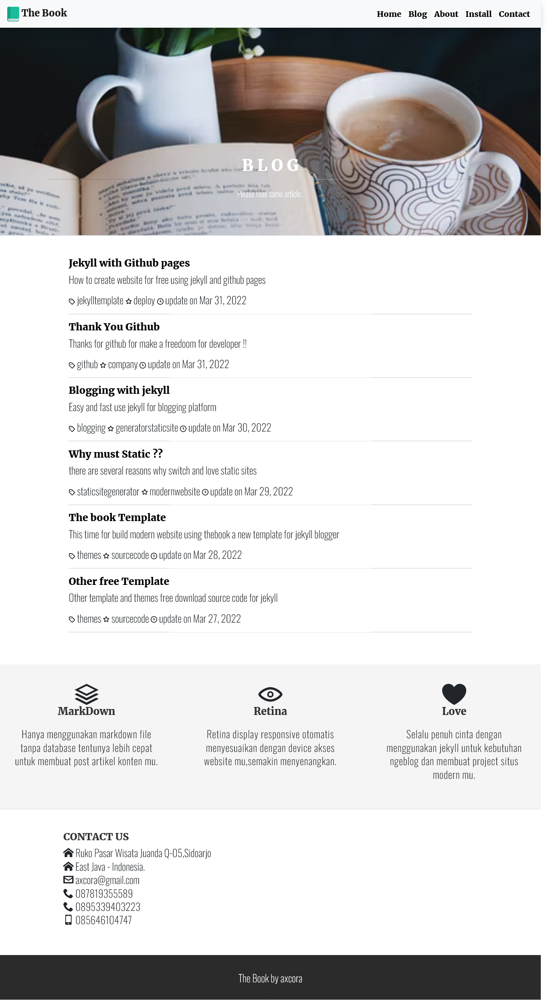

# The Book

### The Book clean responsive display for jekyll blogger

Demo full landing page [https://swalayan.web.app/](https://swalayan.web.app)

Demo [https://thebook.pages.dev/](https://thebook.pages.dev/)

Documentation : [https://www.hockeycomputindo.com/2022/03/github-pages-jekyll-template-themes.html →](https://www.hockeycomputindo.com/2022/03/github-pages-jekyll-template-themes.html)

------------------------

### How to change design display ?? 

just open on config.yml file and you can change design menu in here.

------------------------

Home page area display

Blog List area display

Content area display

----------------------------------

Documentation : [https://www.hockeycomputindo.com/2022/03/github-pages-jekyll-template-themes.html →](https://www.hockeycomputindo.com/2022/03/github-pages-jekyll-template-themes.html)

Demo full landing page [https://swalayan.web.app/](https://swalayan.web.app)

Demo [https://thebook.pages.dev/](https://thebook.pages.dev/)

--------------------------------------------------------------------------------------------------------------------

### Buy me a coffee ☕️ ❤️  ✌🏻 

--------------------------------------------------------------------------------------------------------------------

